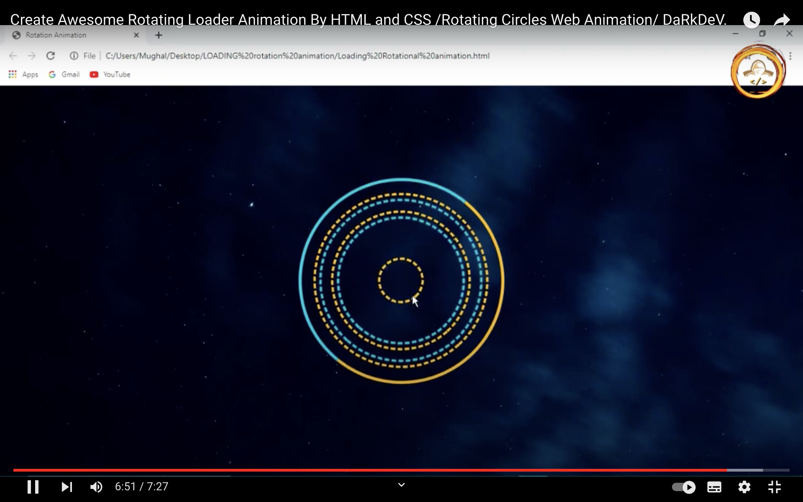

# 1. yixu2046_9103_tut04
This is my week 8 quiz, it contains two parts.

## Part 1
I drew inspiration from Madagascar 3's 'Circus Fireworks song' clip. The animators cleverly used spinning circles to mimic fireworks, creating a vibrant and captivating visual. I was interested in Pacita Abad's Wheels of Fortune for my final work. I want to incorporate the spinning circle concept. It adds dynamism, conveying life's flux and vigour. The spinning circle embodies the perpetual motion symbolized by the Wheel of Fortune, depicting life's ceaseless evolution.

## Part 2
I implemented a circle animation selection using HTML and CSS to simulate the dynamic effects in Pacita Abad's work. I can define the animation effect using CSS's '@keyframes' rule and apply it to an HTML element. Specifically, I can create a circular HTML element and use CSS to define a rotating animation. By adjusting the animation's duration, speed, and other styling properties, I can dynamically rotate the circle in Pacita Abad's artwork. In addition, I can incorporate transitions and transformations in CSS to further enhance the visual impact of the animation.

[Example Implementation](https://codepen.io/inigoiparra/pen/Exxvzm)